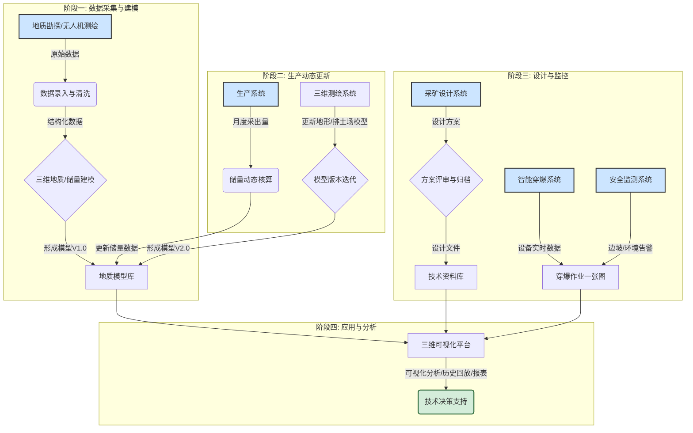

# 智慧矿山技术管理中心 - 技术方案：第一部分 需求深度解析

## 1. 核心功能需求 (Core Functional Requirements)

基于《智慧矿山设计.md》PRD及相关功能架构图，我们将核心功能需求提炼并重组为以下五大业务模块，每个模块下辖若干关键功能点：

### 1.1. 地质保障与三维可视化模块
这是系统的核心与亮点，旨在将静态的地质数据转化为动态、可视的数字资产。
- **三维场景核心 (3D Scene Core)**:
    - **能力要求**: 高性能加载与流畅渲染大规模地质模型，包括`开采境界`、`地形地貌`、`台阶`、`钻孔`、`道路网络`等。
    - **交互要求**: 支持基础的场景`旋转`、`平移`、`缩放`。
- **时空动态演化 (Spatiotemporal Simulation)**:
    - **功能**: 通过时间轴滑块，动态展示不同时期（年/季）的`剥采排工程`形态与位置，实现开采过程的可视化回溯与展望。
- **多维信息图层控制 (Layered Information Control)**:
    - **功能**: 以图层形式叠加展示各类信息，并可独立控制显隐。
    - **关键图层**: `台阶参数`、`钻孔信息`、`开拓运输系统`、`煤层信息（厚度、倾角等）`、`无人机实景三维模型`。
- **模型历史回放与对比 (Model History Comparison)**:
    - **特色功能**: 在独立的双视窗或单视窗时间轴模式下，加载不同版本的地质模型，进行直观的`差异对比分析`。

### 1.2. 储量动态管理模块
实现对矿山核心资产（储量）的精细化、动态化管理与核算。
- **储量驾驶舱 (Reserves Dashboard)**:
    - **功能**: 通过KPI指标卡，宏观展示`地质储量`、`工业储量`、`可采储量`、`累计采出量`等核心数据。
- **精细化储量台账 (Detailed Reserve Ledger)**:
    - **功能**: 以数据表格和列表形式，详细管理`开拓煤量`、`备采煤量`、`控制资源量`、`推断资源量`等，并支持按月/累计查看。
- **储量统计与报表 (Reserves Reporting)**:
    - **功能**: 根据模板和时间范围，自动生成标准化的储量统计报表，并支持`一键导出Excel`。

### 1.3. 采矿设计与工程质量集成模块
作为平台枢纽，无缝集成外部专业设计与管理系统。
- **无缝集成容器 (Seamless Integration Container)**:
    - **实现方式**: 采用`<iframe>`或类似Web组件，将专业的`采矿设计软件`和`采矿工程质量管理软件`的Web端嵌入平台。
    - **体验要求**: 需考虑`单点登录（SSO）`方案，避免用户二次登录，并确保界面自适应。

### 1.4. 智能穿爆作业监控模块
对接并融合穿爆子系统的数据，实现远程、实时的作业监控与风险预警。
- **穿爆作业一张图 (Drilling & Blasting Dashboard)**:
    - **功能**: 在矿区2D/3D地图上，以动态图标实时展示`智能钻机`、`测孔机器人`、`智能装药车`等设备的位置和作业状态。
- **设备运行数据面板 (Equipment Data Panel)**:
    - **功能**: 点击设备图标，实时展示其`钻进深度`、`装药量`、`发动机转速`等关键运行参数和效率分析图表。
- **风险联动预警 (Collaborative Risk Alert)**:
    - **功能**: 接收并展示来自`安全监测系统`（如边坡失稳）或设备自身的异常告警，并在地图上高亮闪烁相关设备。

### 1.5. 技术资料全生命周期管理模块
构建一个结构化、可追溯、易于分析的电子档案中心。
- **三栏式资料库 (Three-Column Archive)**:
    - **布局**: `左侧`为分类树（模型、图纸、文件），`中间`为文件列表，`右侧`为预览和详情区。
- **标准化文件操作 (Standard File Operations)**:
    - **功能**: 提供`上传`、`检索`、`浏览`、`下载`、`版本管理`等基础功能。
- **在线预览与标记 (Online Preview & Annotation)**:
    - **功能**: 支持PDF、图片等格式的在线预览，并提供`高亮`、`批注`等在线标记工具。
- **资料统计分析 (Data Statistics)**:
    - **功能**: 通过`饼图`、`柱状图`等形式，对资料数量、类别占比、月度新增等进行统计分析。

---

## 2. 关键非功能性需求 (Key Non-Functional Requirements)

非功能性需求决定了系统的质量、稳定性和可维护性，是技术架构设计的关键输入。

### 2.1. 系统性能 (Performance)
- **三维渲染性能**:
    - **要求**: 核心三维场景必须保证高帧率（目标 > 30 FPS）下的流畅交互。能够高效加载和渲染大规模、高精度的地质模型和点云数据（百万级顶点/点）。
    - **策略**: 需采用成熟的Web 3D引擎，并结合LOD（多细节层次）、数据压缩、GPU加速等优化技术。
- **数据响应时间**:
    - **要求**: 储量数据、设备状态等关键信息的查询和刷新，响应时间应在2秒以内。报表生成时间根据数据量大小而定，但应提供异步生成和通知机制。
- **并发用户数**:
    - **要求**: 系统应能支持至少50个并发用户的常规操作，峰值并发用户100人。

### 2.2. 数据精度与一致性 (Data Accuracy & Consistency)
- **数据精度**:
    - **要求**: 地质模型、钻孔坐标、测量数据等必须保证高精度，与源数据保持一致，满足矿山生产的技术规范要求。
- **数据一致性**:
    - **要求**: 系统需与`生产系统`、`安全系统`、`设备系统`等进行数据对接。必须建立有效的数据同步和校验机制，确保“技术管理中心”展示的数据与其他系统的数据保持实时或准实时一致。
- **数据来源**:
    - **要求**: 所有关键业务数据（如储量、采出量）必须有明确的来源和审计追溯路径。

### 2.3. 可扩展性与可维护性 (Scalability & Maintainability)
- **模块化设计**:
    - **要求**: 系统必须采用模块化架构，各功能模块（地质、储量、穿爆等）应低耦合，可独立开发、部署和升级。
- **接口标准化**:
    - **要求**: 对外（如集成专业设计软件）和对内（模块间通信）的API接口必须标准化、文档化，便于未来新增功能模块或替换现有模块。
- **配置化能力**:
    - **要求**: 报表模板、考核标准、预警阈值等业务规则应支持在线配置，而非硬编码，以适应业务变化。

### 2.4. 系统安全性 (Security)
- **访问控制**:
    - **要求**: 建立基于角色的访问控制（RBAC）体系，不同角色（如技术员、总工程师、管理员）对不同数据和功能（如储量修改、资料删除）拥有严格区分的权限。
- **数据安全**:
    - **要求**: 核心技术资料（地质模型、设计图纸）的传输和存储需进行加密处理。防止未经授权的下载和拷贝。
- **操作审计**:
    - **要求**: 对所有关键操作（如数据修改、文件上传/删除、审批）进行日志记录，确保所有行为可追溯、可审计。

### 2.5. 跨平台兼容性 (Cross-Platform Compatibility)
- **浏览器兼容性**:
    - **要求**: 前端界面应兼容主流现代浏览器（Chrome, Firefox, Edge）的最新版本。
- **移动端适配**:
    - **要求**: 针对现场管理需求，部分核心功能（如隐患上报、任务执行、设备报修）需要设计移动端友好的界面，或开发配套的移动App。
---

## 3. 关键业务流程与数据流 (Key Business & Data Flow)

### 3.1. 核心业务流程 (Mermaid - `flowchart`)

下图描述了从地质数据输入到最终形成技术决策支持的端到端核心业务流程：



### 3.2. 系统数据流架构 (Mermaid - `graph`)

下图展示了“技术管理中心”作为数据枢纽，与外部系统及内部模块之间的数据流转关系：

```mermaid
graph TD
    subgraph "外部数据源 (External Systems)"
        Ext_Prod[生产执行系统]
        Ext_Safety[安全监测系统]
        Ext_Equip[设备管理系统]
        Ext_Mapping[三维测绘系统]
        Ext_Design[专业设计软件]
    end

    subgraph "技术管理中心 (Technical Management Center)"
        subgraph "数据接入与适配层 (Adapter)"
            Adapter_API[API网关 / 数据接口]
        end

        subgraph "核心功能模块 (Core Modules)"
            Mod_3D[三维可视化模块]
            Mod_Reserve[储量管理模块]
            Mod_Drill[穿爆监控模块]
            Mod_Doc[技术资料模块]
        end

        subgraph "核心数据库 (Database)"
            DB_Geo[地质模型库]
            DB_Reserve[储量数据库]
            DB_Doc[文件资料库]
            DB_Meta[元数据库/台账]
        end
    end

    %% 数据流向
    Ext_Prod -- "采出量, 生产进度" --> Adapter_API
    Ext_Safety -- "边坡/环境告警" --> Adapter_API
    Ext_Equip -- "穿爆设备运行参数" --> Adapter_API
    Ext_Mapping -- "实景模型, 点云数据" --> Adapter_API
    Ext_Design -- "设计图纸/文件" --> Adapter_API

    Adapter_API --> Mod_Reserve
    Adapter_API --> Mod_Drill
    Adapter_API --> Mod_Doc

    Mod_Reserve -- "读写储量数据" --> DB_Reserve
    Mod_Doc -- "读写文件, 模型" --> DB_Doc
    Mod_Doc -- "读写模型" --> DB_Geo
    Mod_Reserve -- "更新元数据" --> DB_Meta
    Mod_Drill -- "读取设备元数据" --> DB_Meta

    DB_Geo --> Mod_3D
    DB_Reserve --> Mod_3D
    DB_Meta --> Mod_3D

    Mod_3D -- "渲染/分析/展示" --> User[用户界面]

    %% 样式
    style Ext_Prod fill:#fff0f6,stroke:#c31d6b
    style Ext_Safety fill:#fff0f6,stroke:#c31d6b
    style Ext_Equip fill:#fff0f6,stroke:#c31d6b
    style Ext_Mapping fill:#fff0f6,stroke:#c31d6b
    style Ext_Design fill:#fff0f6,stroke:#c31d6b
    style DB_Geo fill:#e6f7ff,stroke:#1890ff
    style DB_Reserve fill:#e6f7ff,stroke:#1890ff
    style DB_Doc fill:#e6f7ff,stroke:#1890ff
    style DB_Meta fill:#e6f7ff,stroke:#1890ff
    style User fill:#d4edda,stroke:#155724