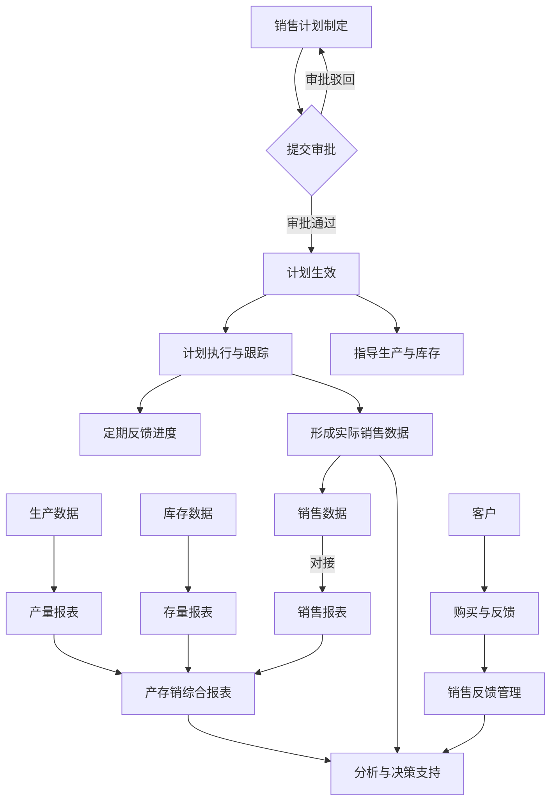

## 1. 文档引言

### 1.1. 项目背景
为提升煤矿企业的精细化管理水平，打通生产、库存、销售各环节数据壁垒，实现业务流程的闭环管理与数据驱动决策，特规划建设“产存销管理中心”系统。该系统旨在通过信息技术手段，对销售计划、库存存量、产销数据及销售反馈进行集中管控，从而优化资源配置、降低运营成本、提高整体经济效益。

### 1.2. 目的与范围
本产品需求文档（PRD）旨在清晰、完整地描述“产存销管理中心”的功能性和非功能性需求。 本文档将作为后续产品设计、研发、测试及验收的主要依据，确保项目团队对产品有统一的理解和目标。

**核心目标：**

*   实现销售计划的制定、审批、跟踪与分析的全生命周期管理。
*   实时、准确地监控煤炭库存量，为生产和销售提供可靠数据。
*   整合产、存、销数据，提供多维度的报表分析与可视化展示。
*   建立销售数据与客户反馈的快速响应机制。

**项目范围：**
本项目主要围绕“销售计划”、“存量管理”、“产存销报表”和“销售反馈”四个核心模块展开，并包含与地磅房无人值守系统等外部系统的数据对接。

### 1.3. 名词解释
| 术语 | 解释 |
| --- | --- |
| PRD | Product Requirement Document，产品需求文档。 |
| 产存销 | 生产、存储、销售的简称。 |
| 筒仓 | 用于储存散装物料（如煤炭）的筒形构筑物。 |
| 雷达料位计 | 一种通过发射和接收雷达波来测量物料高度的设备。 |
| 外协用煤 | 指企业从外部协作单位购入或调用的煤炭。 |
| 收方量 | 指经过计量确认的、收到的物料数量。 |

---

## 2. 整体业务流程

---

## 3. 功能需求详述

### 3.1. 销售计划 (Sales Plan)

#### 3.1.1. 概述
提供销售计划的制定、编辑、审批、发布、跟踪与分析功能，实现对销售业务的闭环管理。

#### 3.1.2. 功能点

**1. 计划制定与编辑**
*   **创建计划：** 用户可创建新的销售计划，支持按年度、季度、月度等时间维度制定。
*   **计划内容字段：**
    *   计划名称（必填）
    *   开始日期（必填）
    *   截止日期（必填）
    *   销售煤量（吨）（必填）
    *   煤质要求（如：热值、硫分等）
    *   预估销售金额（元）
    *   销售渠道（如：直销、分销等）
    *   责任人（必填，关联用户列表）
    *   备注说明
*   **编辑与草稿：** 支持对未提交审批的计划进行编辑和保存为草稿。

**2. 审批流程**
*   **提交审批：** 计划编制完成后，可提交至审批流程。
*   **审批权限：** 具备审批权限的用户（如：销售主管、经理）可对提交的计划进行“通过”或“驳回”操作。
*   **审批意见：** 审批人可填写审批意见，驳回时必须填写原因。
*   **状态变更：** 计划状态随审批操作（待提交、审批中、已通过、已驳回）自动更新。
*   **通知提醒：** 审批状态变更后，系统自动向计划制定人和相关责任人发送通知。

**3. 计划发布与生效**
*   **自动生效：** 审批通过的销售计划，在到达其“开始日期”时，状态自动变更为“执行中”。
*   **计划查看：** 所有相关人员可查看已发布和生效的计划详情。

**4. 执行跟踪与反馈**
*   **进度反馈：** 责任人需在计划执行期间，定期（如每周）在系统中反馈执行情况。
*   **反馈内容：**
    *   当前完成煤量
    *   完成金额
    *   执行进度（系统可根据完成量与计划量自动计算百分比）
    *   需要协调的事项说明
*   **进度可视化：** 以进度条或图表形式直观展示计划的完成情况。

**5. 计划总结与分析**
*   **计划完成情况：** 计划到达“截止日期”后，系统自动汇总最终执行数据，并与计划目标进行对比。
*   **问题分析与改进：** 责任人需填写计划总结，包括问题分析和后续改进措施。
*   **历史回溯：** 支持按时间、责任人、渠道等多维度查询历史销售计划、执行情况及最终评价。
*   **统计分析：** 提供多维度统计图表（如柱状图、折线图），分析各时间周期、各责任人的计划完成率、销售额等指标。

**6. 与地磅房无人值守系统对接**
*   **数据采集：** 实时或准实时接收地磅房系统传递的数据。
    *   车辆信息：车牌号、车型等。
    *   称重信息：毛重、皮重、净重。
    *   监控视频信息：关联称重记录的视频流地址或录像片段。
*   **异常预警：**
    *   **车牌与车辆不符：** 将系统记录的车辆信息与地磅系统识别的车牌进行比对，不符时触发预警。
    *   **称重异常：** 设置合理的称重范围阈值，超出范围时触发预警（如：皮重与历史记录偏差过大）。
    *   预警方式：系统内消息、短信或邮件通知相关管理人员。
*   **数据查询与回看：**
    *   支持按车牌号、时间范围等条件查询历史装车数据。
    *   在查询结果中，可直接点击回看该次装车的监控视频。

### 3.2. 存量管理 (Inventory Management)

#### 3.2.1. 概述
通过技术手段和管理流程，实现对筒仓存煤、临时堆煤以及损耗量的精确管理，确保库存数据的实时性和准确性。

#### 3.2.2. 功能点

**1. 筒仓存煤量实时监测**
*   **数据接入：** 对接筒仓的雷达料位计传感器数据，实时获取料位高度。
*   **实时计算：**
    *   系统预设筒仓的截面积参数。
    *   根据公式 `存煤量 = 料位高度 × 筒仓截面积 × 煤炭平均密度` 实时计算并更新存煤量。
    *   煤炭平均密度可作为系统可配置参数。
*   **可视化展示：**
    *   在Dashboard或专门的库存监控页面，以图形化方式（如：模拟筒仓图）实时展示各筒仓的料位和存煤量。
    *   设置高位、低位预警线，当存量触达预警线时，系统自动告警。

**2. 临时堆煤量管理**
*   **盘点录入：** 提供界面供仓储管理人员定期（如每日、每周）录入临时煤堆的盘点数据。
*   **数据字段：**
    *   盘点日期
    *   煤堆编号/位置
    *   盘点数量（吨）
    *   盘点人
    *   备注
*   **进出场计划：**
    *   可根据生产和销售计划，为临时堆煤制定预计的进场和出场时间。
    *   对超期堆放的煤炭进行提醒，以辅助管理决策，降低成本。
*   **历史查询：** 支持查询历史盘点记录。

**3. 损耗量管理**
*   **分类统计：**
    *   提供数据录入或接口，用于分类记录各类损耗量。
    *   损耗分类：
        *   外协用煤
        *   生产排弃废料（煤灰、火煤、杂脏煤）
        *   损耗煤（风吹、自燃等自然损耗）
*   **数据记录：** 记录每笔损耗发生的时间、数量、责任部门/人员和原因说明。
*   **统计分析：** 按月度、季度生成各类损耗量的统计报表，分析损耗构成和趋势。

### 3.3. 产存销报表 (Production, Storage, and Sales Report)

#### 3.3.1. 概述
整合产量、存量和销量数据，生成统一的产存销综合报表和关系图表，为管理层提供全面的数据视图和决策支持。

#### 3.3.2. 功能点

**1. 产量报表生成**
*   **数据来源：** 接收或调取技术部门提供的收方量数据（可手动导入或通过接口对接）。
*   **报表维度：** 支持按日、周、月、季度、年度生成产量报表。
*   **报表内容：** 包含但不限于产量、完成率（与生产计划对比）、不同煤质产品的产量分布等。

**2. 产存销综合报表**
*   **数据整合：** 自动调取生产报表、存量报表（筒仓+临时堆煤-损耗）和销售报表的数据。
*   **核心报表：“产存销平衡表”**
    *   **计算逻辑：** `期末库存 = 期初库存 + 本期产量 - 本期销量 - 本期损耗`
    *   **展示形式：** 以表格形式清晰展示指定时间周期内（如月度）的各项数据。
*   **报表统一展示：** 在该模块下，集中展示产量、存量、销量、损耗以及产存销平衡表等所有相关报表。
*   **数据导出：** 所有报表支持导出为Excel或PDF格式。

**3. 关系图表可视化**
*   **数据可视化：** 将产、存、销的核心数据以图表形式展示。
*   **图表类型：**
    *   **趋势图：** 使用折线图展示一段时间内产量、销量和库存量的变化趋势。
    *   **对比图：** 使用柱状图对比计划销量与实际销量、计划产量与实际产量。
    *   **结构图：** 使用饼图展示不同销售渠道的销量占比或不同煤质产品的产量占比。
*   **交互式筛选：** 用户可根据时间范围、产品类型等条件筛选图表数据。

### 3.4. 销售反馈 (Sales Feedback)

#### 3.4.1. 概述
建立销售数据和客户反馈的实时收集与管理机制，帮助企业快速响应市场变化，持续改进产品和服务。

#### 3.4.2. 功能点

**1. 销售数据实时反馈**
*   **数据看板 (Dashboard)：**
    *   在系统首页或专门的看板页面，实时展示关键销售指标。
    *   **关键指标：** 今日/本周/本月销售量、销售额，销售价格波动，各渠道销售占比等。
    *   数据以数字、图表等直观形式呈现，并能自动刷新。
*   **客户信息集成：**
    *   关联销售数据与客户信息，可快速查看某客户的购买历史、购买频率等。

**2. 客户反馈管理**
*   **反馈信息收集：**
    *   提供表单供销售人员或客服人员录入客户反馈信息。
    *   **反馈内容字段：**
        *   客户名称
        *   反馈日期
        *   反馈类型（产品质量、服务水平、交货期等）
        *   反馈内容详述
        *   处理状态（待处理、处理中、已解决）
        *   负责人
*   **处理流程跟踪：**
    *   系统记录反馈的处理过程，包括处理人员、处理时间和处理结果。
*   **查询与分析：**
    *   支持按客户、反馈类型、时间范围等条件查询反馈记录。
    *   定期生成客户反馈统计报告，分析主要问题点，为产品和服务改进提供依据。